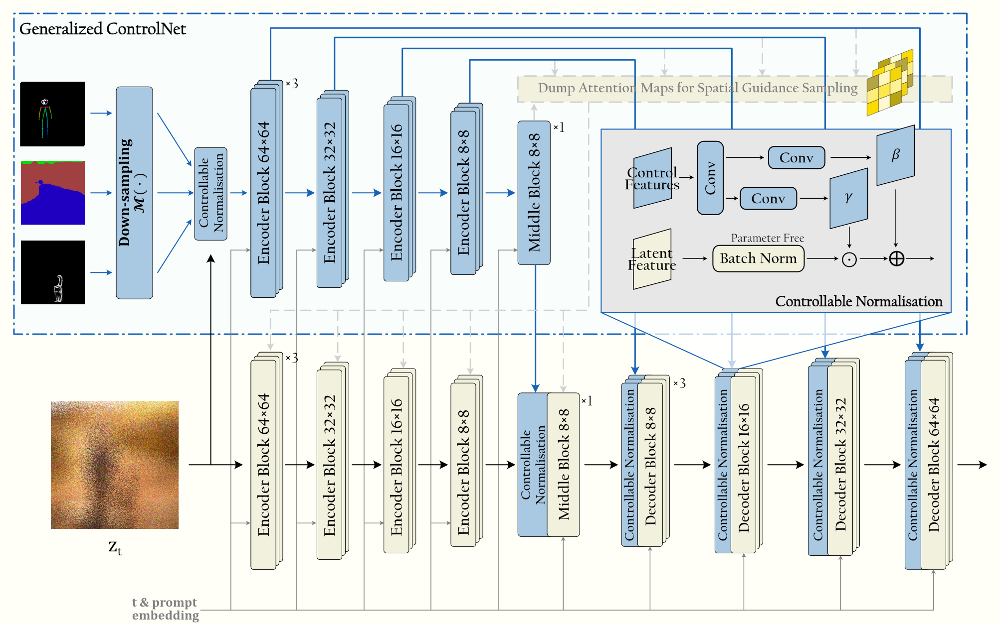
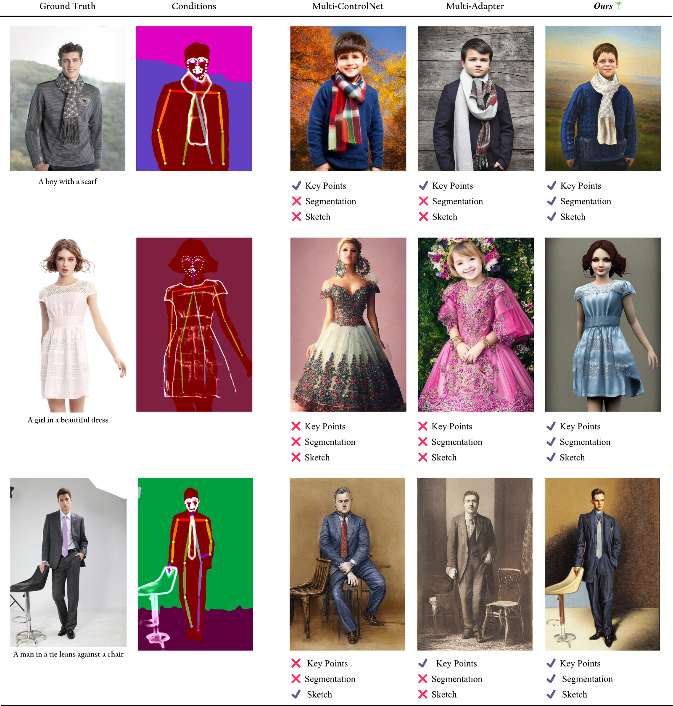

# *Cocktail*🍸: Unified Discrete Diffusion for Simultaneous Vision-Language Generation


<!-- <a href=""></a>  -->
<a href="https://mhh0318.github.io/cocktail/"></a>
<a href="https://opensource.org/licenses/MIT"></a> 
<a href="https://huggingface.co/MichaelHu/cocktail"></a> 


Our approach requires only one generalized model, unlike previous that needed multiple models for multiple modalities. 
Different from currently existing schemes, our scheme does not require modifications to the modal prior of the base model <strong>Fig.(a)</strong>, which results in a significant reduction in cost. Also in the face of multiple modalities we do not need multiple models demonstrated in <strong>Fig.(b)</strong>. Cocktail🍸 fuse the information from multiple modalities like <strong>Fig.(c)</strong> shown.

## Abstract 


Text-conditional diffusion models are able to generate high-fidelity images with diverse contents.However, linguistic representations frequently exhibit ambiguous descriptions of the envisioned objective imagery, requiring the incorporation of additional control signals to bolster the efficacy of text-guided diffusion models. In this work, we propose Cocktail, a pipeline to mix various modalities into one embedding, amalgamated with a generalized ControlNet (gControlNet), a controllable normalisation (ControlNorm), and a spatial guidance sampling method, to actualize multi-modal and spatially-refined control for text-conditional diffusion models. Specifically, we introduce a hyper-network gControlNet, dedicated to the alignment and infusion of the control signals from disparate modalities into the pre-trained diffusion model. gControlNet is capable of accepting flexible modality signals, encompassing the simultaneous reception of any combination of modality signals, or the supplementary fusion of multiple modality signals. The control signals are then fused and injected into the backbone model according to our proposed ControlNorm. Furthermore, our advanced spatial guidance sampling methodology proficiently incorporates the control signal into the designated region, thereby circumventing the manifestation of undesired objects within the generated image. We demonstrate the results of our method in controlling various modalities, proving high-quality synthesis and fidelity to multiple external signals.

## Pipeline



The parameters indicated by the yellow sections are sourced from the pre-trained model and stay constant, while only those in the blue sections are updated during training, with the gradient back-propagated along the blue arrows. The noise-perturbed images are injected into the gControlNet via the ControlNorm, which also channels the dimensionally distinct control signals obtained from the gControlNet into the pre-trained network with rich semantic information. The light grey dashed sections signify additional operations that occur solely during the inference process, specifically, the process of storing attention maps derived from the gControlNet for the sampling stage.

## Results





## TODO

- [ ] Release Gradio Demo
- [ ] Release sampling codes
- [x] Release inference codes
- [x] Release pre-trained models

## Setup

### Installation Requirmenets

You can create an anaconda environment called `cocktail` with the required dependencies by running:

```
git clone https://github.com/mhh0318/cocktail.git
cd cocktail
conda env create -f environment.yaml
```

### Download Pretrained Weights

Download the pretrained models from [here](https://huggingface.co/MichaelHu/cocktail), and save it to the root dir.


### Quick Inference

For the simultaneous vision-language generation, please run:

```bash
python ./inference {args}
```
args here can be int 0 or 1, as the provided two example conditions.


If the environment is setup correctly, this command should function properly and generate some results in the folder `./samples/results/{args}_sample_{batch}.png`.


## Comments 

Our codebase for the diffusion models builds heavily on [ControlNet](https://github.com/lllyasviel/ControlNet) and  [Stable Diffusion](https://github.com/CompVis/stable-diffusion).

Thanks for the opensourcing!

